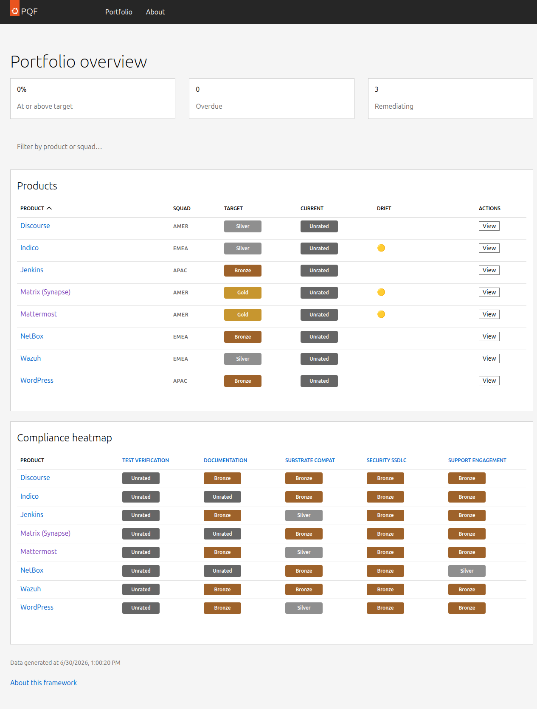

# PQF — Product Quality Framework

[](https://github.com/srbouffard/pqf/actions/workflows/ci.yml)
[](https://github.com/srbouffard/pqf/actions/workflows/deploy-pages.yml)

PQF tracks the quality and compliance state of Canonical Platform Engineering's product portfolio. Products are scored automatically across five quality dimensions (test coverage, documentation, security, substrate compatibility, support engagement) and awarded a **bronze / silver / gold** medal based on configurable criteria.

**[Live dashboard →](https://srbouffard.github.io/pqf/)**



---

## Quick links

| | |
|-|-|
| 📊 [Live dashboard](https://srbouffard.github.io/pqf/) | The deployed UI |
| 🏗 [Architecture](docs/architecture.md) | How the system works |
| ➕ [Add a product](docs/adding-a-product.md) | Onboard a new product |
| 🔧 [Add a dimension](docs/adding-a-dimension.md) | Create a new scorer |
| 🤝 [Contributing](CONTRIBUTING.md) | Local setup and PR workflow |
| 🤖 [AGENTS.md](AGENTS.md) | AI agent onboarding |

---

## 30-second quickstart

```bash
# Python engine
pip install -e ".[dev]"
make test

# React UI
make install-ui
make dev          # → http://localhost:5173
```

---

## Makefile targets

| Target | Description |
|--------|-------------|
| `make install` | Install Python dev dependencies |
| `make install-ui` | Install Node/UI dependencies |
| `make install-all` | Install everything |
| `make lint` | Lint Python with ruff |
| `make format` | Auto-format Python with ruff |
| `make format-check` | Check formatting without modifying |
| `make test` | Run Python unit tests |
| `make test-ui` | Run Vitest UI unit tests |
| `make test-all` | Run Python + UI tests |
| `make build` | Build the React app (`ui/dist/`) |
| `make dev` | Start Vite dev server |
| `make e2e` | Run Playwright E2E tests |
| `make audit` | Run pip-audit + npm audit |
| `make score PRODUCT=<id>` | Score a product locally (needs `GITHUB_TOKEN` + `OPENROUTER_API_KEY`) |
