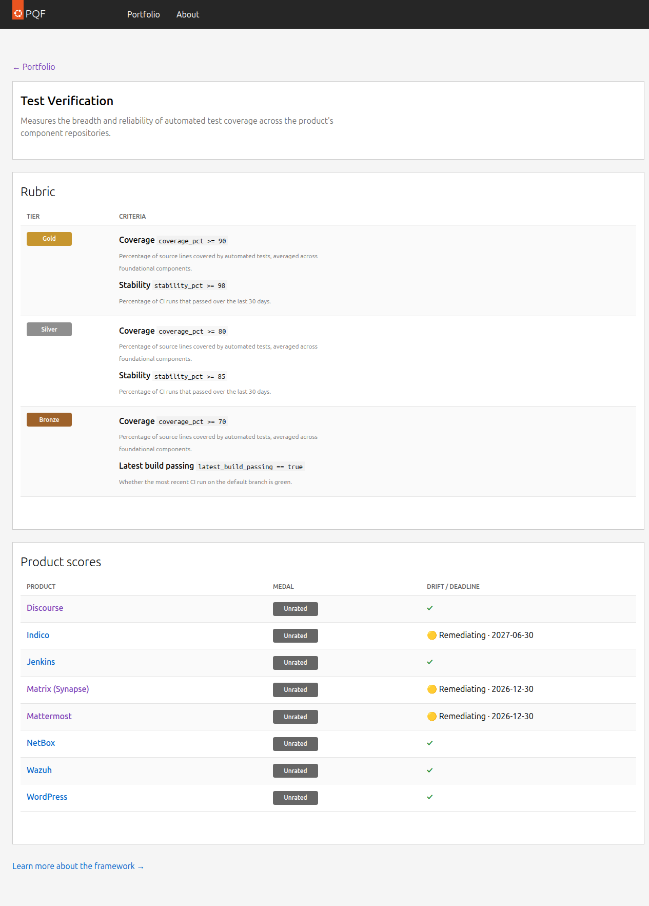

# Dimension Detail

The Dimension Detail page explains everything about one quality dimension — what metrics are measured, how medals are awarded, and where every product currently stands.

---

## Metrics Card

The **Metrics** card lists every output metric for this dimension.

| Column | Description |
|--------|-------------|
| **Metric** | Human-readable name of the metric |
| **Description** | What it measures and how |
| **Type / Range** | `boolean` (true/false) or `number` with the value range |
| **Method** | How the metric is computed |

### AI badge

Metrics marked **✦ AI** are scored by an LLM (Claude via OpenRouter) rather than deterministic API checks. These metrics involve qualitative judgements — for example, whether documentation covers all four Diátaxis doc types.

Fully deterministic metrics (GitHub API checks, file existence, etc.) show **Deterministic**.

---

## Medal Rubric

The **Medal Rubric** shows exactly what a product needs to achieve each medal tier.

Each row is one criterion in the format `**Metric label** expression` (e.g., `**Coverage** >= 80`). Hover over any criterion to see the full metric description as a tooltip.

Medal tiers are cumulative — to earn gold, a product must also meet all bronze and silver criteria.

---

## Product Scores

The bottom table shows every tracked product's current medal for this dimension, sorted by medal (best first). Click any product name to jump to its [Product Detail](product-detail.md) page.
