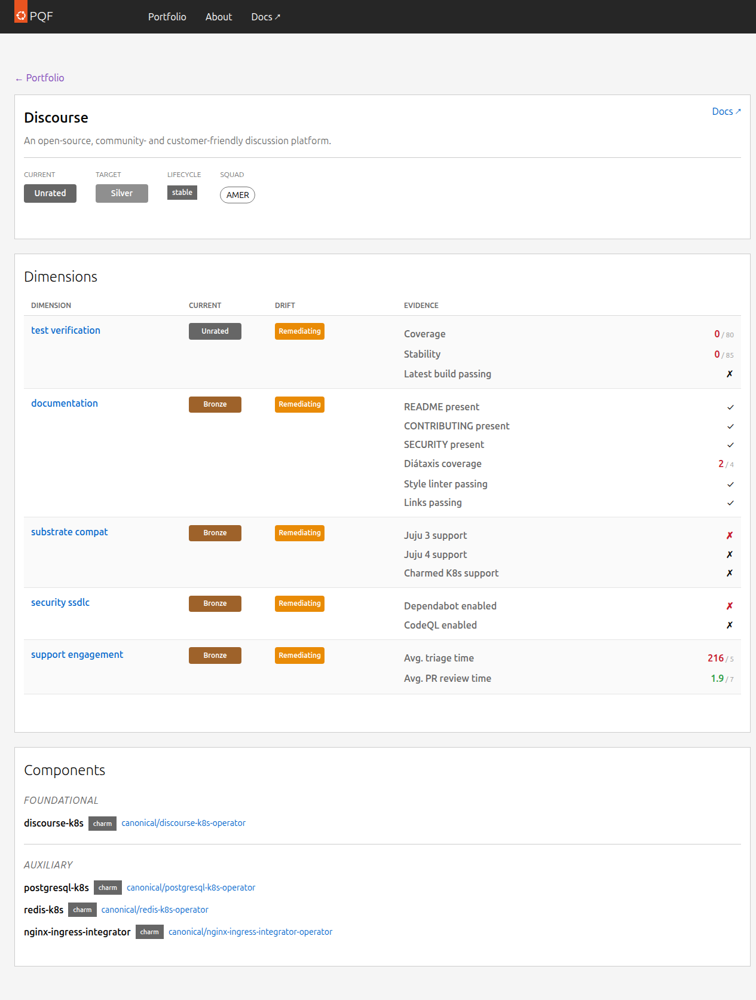

# Product Detail

The Product Detail page shows the full quality breakdown for a single product — one row per quality dimension with current medal, target, and evidence.

---

## Header Card

The header shows:
- **Product name and description**
- **Overall medal** — the lowest medal achieved across all dimensions (the bottleneck)
- **Target medal** — the committed target
- **Squad** — the owning team, linked to their GitHub team page

---

## Dimension Score Cards

Each quality dimension has its own card showing:

| Column | Description |
|--------|-------------|
| **Dimension** | Dimension name, linking to its Dimension Detail page |
| **Medal** | Current medal for this dimension (may differ from the overall) |
| **Evidence** | The raw metric values used to compute the medal |

### Evidence column

Each evidence row shows one metric with its current value. If the metric is compared against a threshold in the medal rubric, the display shows `value / threshold` colour-coded:

- **Green** — value meets or exceeds the threshold for the target tier
- **Red** — value falls short of the threshold

For boolean metrics, `✓` (pass) or `✗` (fail) is shown.

---

## Navigation

Click any dimension name in the evidence cards to jump to the [Dimension Detail](dimension-detail.md) page for that dimension, which shows the full metric descriptions and the medal rubric.
